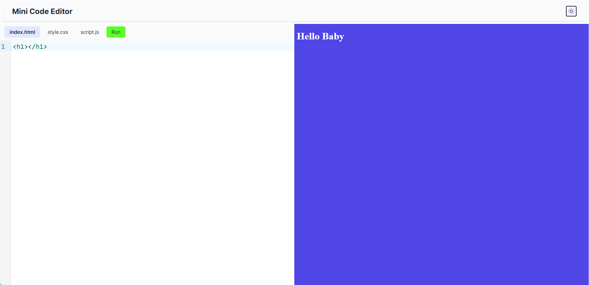
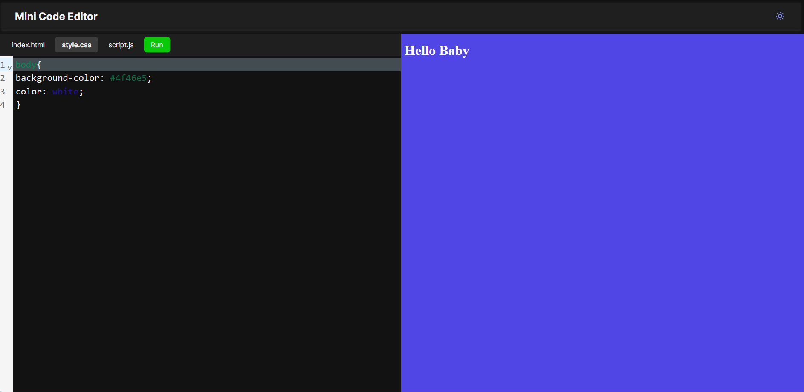

# ⚡️ Minimal Web Code Editor

A lightweight in-browser code editor built with **vanilla JavaScript**, **HTML**, and **CSS**, powered by **CodeMirror 6** and bundled using **Vite**. Supports editing HTML, CSS, and JavaScript with a live preview area.

---

## ✨ Features

- 🧩 Three-tab code editor for HTML, CSS, and JavaScript
- ⚡ Live preview via `iframe` using the "Run" button
- 💾 Auto-save using `localStorage` (code is preserved on refresh)
- 🌓 Light / dark theme toggle
- 📦 Built with Vite and CodeMirror (modular setup)
- 🎯 No frameworks – fully native JS project

---

## 📸 Screenshot




---

## 🛠️ Tech Stack

- **HTML5**
- **CSS3**
- **JavaScript (ES6+)**
- [CodeMirror 6](https://codemirror.net/)
- [Vite](https://vitejs.dev/)

---

## 📁 Folder Structure

```
📦 mini-code-editor
├── public/
├── screenshots/
├── src/
│   ├── script.js
│   ├── style.css
│   └── main.js
├── index.html
├── vite.config.js
└── README.md
```

---

## 🚀 Getting Started

### Clone the Repository

```bash
git clone https://github.com/MSAndromeda/mini-code-editor.git
cd mini-code-editor
```

### Install Dependencies

```bash
npm install
```

### Run Development Server

```bash
npm run dev
```

### Build for Production

```bash
npm run build
```

Deploy the `dist/` folder on Netlify, Vercel, or GitHub Pages.

---

## 📌 Live Demo

[🌐 View Live App](https://msandromeda.github.io/mini-code-editor/)

---

## 🙋‍♂️ Why I Built This

This project was created to demonstrate:

- Proficiency in vanilla JavaScript and DOM manipulation
- Integration of external tools like CodeMirror via npm
- Real-time previewing using secure iframe injection
- Basic state persistence using `localStorage`
- Clean, minimalist frontend UI with theming

---

## 🧠 Lessons Learned

- How to modularize a frontend project using Vite
- Managing DOM-based libraries in a modern JS app
- Using `iframe.srcdoc` to inject and preview live code
- Handling theme toggling and editor switching without frameworks

---

## 📬 Contact

If you’d like to connect or collaborate:

- [LinkedIn](https://www.linkedin.com/in/manas-anand-singh-2414321b8/)
- [Email](mailto:manasanandsingh.andro@gmail.com)

---

## 📄 License

This project is open-source under the [MIT License](LICENSE).

---
